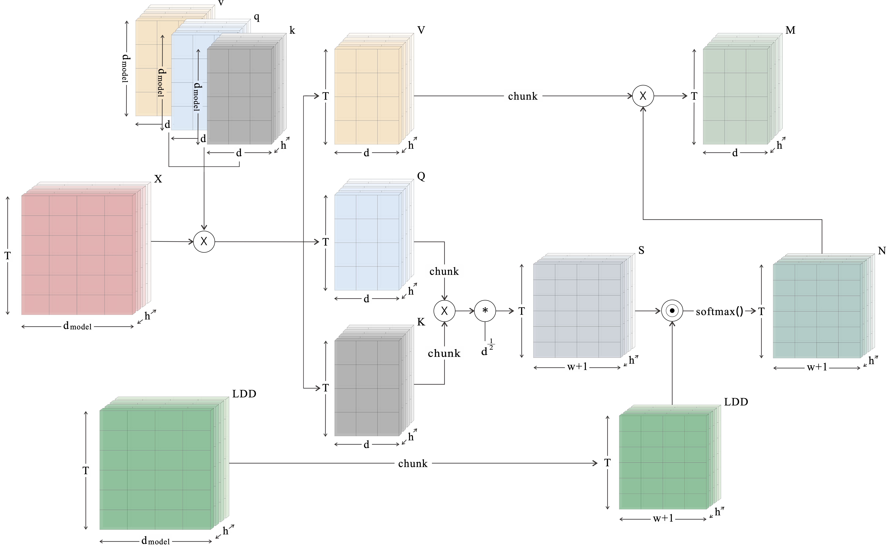

####  Abstract: 
For text summarization, the role of discourse structure is pivotal in discerning the core content of a text. Regrettably, prior studies on incorporating Rhetorical Structure Theory (RST) into transformer-based summarization models only consider the nuclearity annotation, thereby overlooking the variety of discourse relation types. This paper introduces the `RSTformer', a novel summarization model that comprehensively incorporates both the types and uncertainty of rhetorical relations.  Our RST-attention mechanism, rooted in document-level rhetorical structure, is an extension of the recently devised Longformer framework. Through rigorous evaluation, the model proposed herein exhibits significant superiority over state-of-the-art models, as evidenced by its notable performance on several automatic metrics and human evaluation.

    

