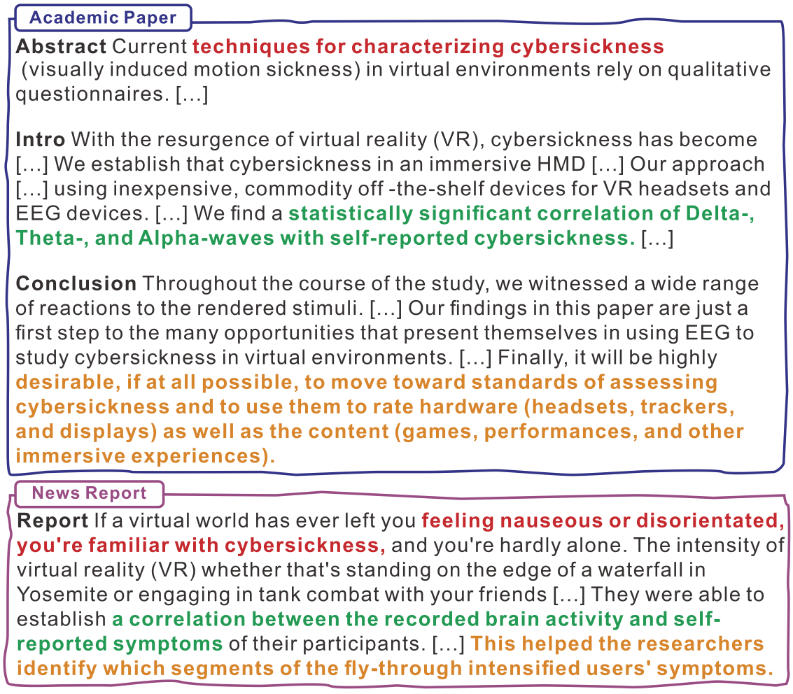

####  Abstract: 
Scientific news reports serve as a bridge, adeptly translating complex research articles into reports that resonate with the broader public. The automated generation of such narratives enhances the accessibility of scholarly insights. In this paper, we present a new corpus to facilitate this paradigm development. Our corpus comprises a parallel compilation of academic publications and their corresponding scientific news reports across nine disciplines. To demonstrate the utility and reliability of our dataset, we conduct an extensive analysis, highlighting the divergences in readability and brevity between scientific news narratives and academic manuscripts. We benchmark our dataset employing state-of-the-art text generation models. The evaluation process involves both automatic and human evaluation, which lays the groundwork for future explorations into the automated generation of scientific news reports.

    

#### Code:
Code is available at: 

#### Citation:
